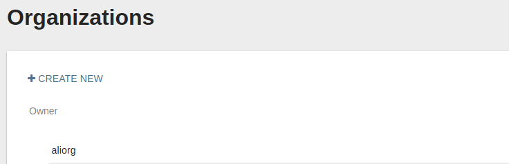
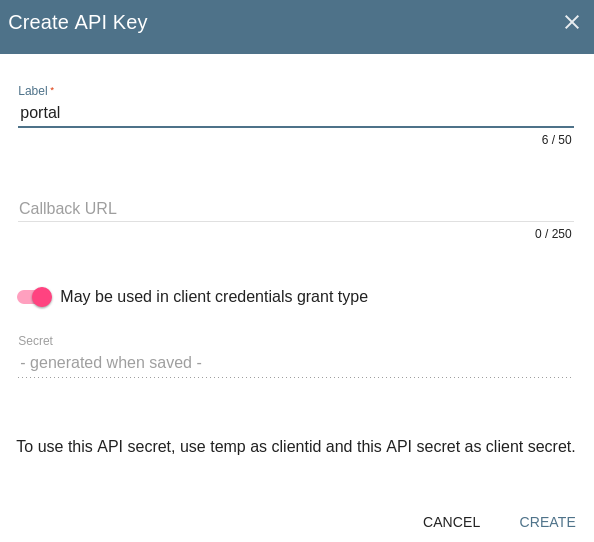
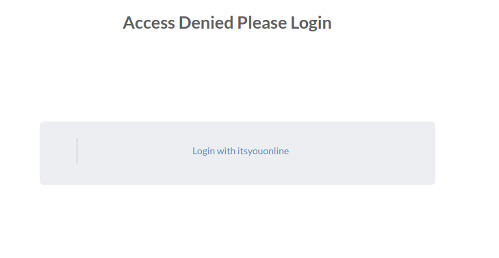

# Portal OAUTH Authentication

## Adding support for specific oauth server

 You need to **add an application in oauth server** in order to obtain a client ID and client SECRET. The following example demonstrates how this is done using itsyouonline.
* Go to organizations page and create a new one:

  

* In the new organization page select `settings` from the available tabs
* Select API access key in the `settings` page and add a new API key:

  

* It is now possible to use this key for oauth in portal running in production mode as follows:

  * OAUTH SERVER AUTHORIZE URL(client_url), i.e; https://itsyou.online/v1/oauth/authorize
  * OAUTH SERVER ACCESS TOKEN URL, i.e; https://itsyou.online/v1/oauth/access_token
  * REDIRECT URL, (FIXED) http://portal_IP:8200/restmachine/system/oauth/authorize
  * SCOPE, i.e; user:email:main,user:memberof:{org name}
  * CLIENT ID, In this case will be the name of our organization(Note client id can be different from an organization)
  * CLIENT SECRET, Get the secret form the API key created
  * USER INFO URL, the API URL for getting user info, https://itsyou.online/api/users/
* The result should be as follows:

  

## Force using oauth only authentication

* During installing portal set the "force_oauth_instance" attribute value to the name of the oauth instance you want to force using.

## Development Section

* Support for oauth authentication is spread across 2 areas
  * **jumpscale client** :  found in lib repo: `Jumpscale9Lib/clients/oauth/OauthInstance.py`
           * You can use it from shell using `j.clients.oauth.get(type='github')`
           * replace type by whatever instance you need.
  * **jumpscale portal support**

* actors: `jumpscale_portal/apps/system/system__oauth` with the following methods:

  * authenticate :`/restmachine//system/oauth/authenticate?type=github` redirects to certain oauth server
  * authorize : `/restmachine//system/oauth/authorize`  call back api oauth server calls
* If username and email returned from oauth server found then user is logged in.
* If username is found but email is different than that returned from oauth server, 400 bad request (User already exists) response is returned
