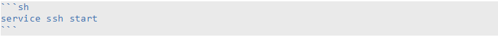

# Wiki Syntax Markdown

Jumpscale allow to write documentation with markdown, you have to use a specific markdown
format, which is a plain-text syntax using text annotation to change the
markup. In this section you find the general text formatting in the
Jumpscale markdown format.


## Heading

```
# h1 test
```
# h1 test

```
## h2 test
```
## h2 test

```
### h3 test
```
### h3 test

```
#### h4 test
```
#### h4 test

```
##### h5 test
```
##### h5 test

```
###### h6 test
```
###### h6 test

***
## General Text Formatting 

### Bold text
```
**Bold text**
```
**Bold text**

### Italic text
```
*Italic text*
```
*Italic text*

### Link
```
[Jumpscale website](http://jumpscale.com/)
```
[Jumpscale website](http://jumpscale.com/)

### Quote
```
> That's a quote

> Unknown
```
> That's a quote

> Unknown

### Strikethrough
```
~~Strikethrough~~
```
~~Strikethrough~~

***
## Listing


### Bulleted list

```
* bullet1
* bullet2
* bullet3
```
* bullet1
* bullet2
* bullet3
 
### Ordered List

```
- A
- B
- C
```
1. A
2. B
3. C

### Line seprator

```
*****
```
*****
 

### Code block



```                                                       
service ssh start
```

### Image

```                                                       

```


***
### Tabels

```
| Header 1 | *Header* 2 |
| -------- | -------- |
| Cell 1 | [Jumpscale](http://jumpscale.com) link |
| Cell 3 | **Cell 4** |
```

| Header 1 | *Header* 2 |
| -------- | -------- |
| Cell 1 | [Jumpscale](http://jumpscale.com) link |
| Cell 3 | **Cell 4** |

```
| Name | Description          |
| ------------- | ----------- |
| Help      | Display the help window.|
| Close     | Closes a window     |
```

| Name | Description          |
| ------------- | ----------- |
| Help      | Display the help window.|
| Close     | Closes a window     |


